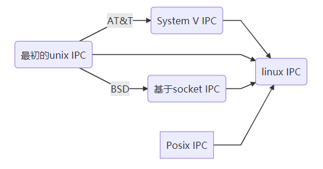

# linux进程间通信（一）：概述

## 概述

Linux下的进程通信手段基本上是从Unix平台上的进程通信手段继承而来的。而对Unix发展做出重大贡献的两大主力AT&T的贝尔实验室及BSD（加州大学伯克利分校的伯克利软件发布中心）在进程间通信方面的侧重点有所不同。前者对Unix早期的进程间通信手段进行了系统的改进和扩充，形成了“system V IPC”，通信进程局限在单个计算机内；后者则跳过了该限制，形成了基于套接口（socket）的进程间通信机制。Linux则把两者继承了下来，如图示：

其中，最初Unix **IPC**（进程间通信：Inter Process Communication）包括：管道、FIFO、信号；System V IPC包括：System V消息队列、System V信号灯、System V共享内存区；

Posix IPC包括： Posix消息队列、Posix信号灯、Posix共享内存区。

有两点需要简单说明一下：

1. 由于Unix版本的多样性，电子电气工程协会（IEEE）开发了一个独立的Unix标准，这个新的ANSI Unix标准被称为计算机环境的可移植性操作系统界面（POSIX）。现有大部分Unix和流行版本都是遵循POSIX标准的，而**Linux从一开始就遵循POSIX标准**；

2. BSD并不是没有涉足单机内的进程间通信（socket本身就可以用于单机内的进程间通信）。事实上，很多Unix版本的单机IPC留有BSD的痕迹，如4.4BSD支持的匿名内存映射、4.3+BSD对可靠信号语义的实现等等。

对于Linux所支持通信手段的不同实现版本（如对于共享内存来说，有Posix共享内存区以及System V共享内存区两个实现版本），将主要介绍Posix API。

Linux下进程间通信的几种主要手段简介：

1. 管道（Pipe）及有名管道（named pipe）：管道可用于具有亲缘关系进程间的通信，有名管道克服了管道没有名字的限制，因此，除具有管道所具有的功能外，它还允许无亲缘关系进程间的通信；
2. 信号（Signal）：信号是比较复杂的通信方式，用于通知接受进程有某种事件发生，除了用于进程间通信外，进程还可以发送信号给进程本身；Linux除了支持Unix早期信号语义函数sigal外，还支持语义符合Posix.1标准的信号函数sigaction（实际上，该函数是基于BSD的，BSD为了实现可靠信号机制，又能够统一对外接口，用sigaction函数重新实现了signal函数）；

3. 报文（Message）队列（消息队列）：消息队列是消息的链接表，包括Posix消息队列system V消息队列。有足够权限的进程可以向队列中添加消息，被赋予读权限的进程则可以读走队列中的消息。消息队列克服了信号承载信息量少，管道只能承载无格式字节流以及缓冲区大小受限等缺点。
4. 共享内存：使得多个进程可以访问同一块内存空间，是最快的可用IPC形式。是针对其他通信机制运行效率较低而设计的。往往与其它通信机制，如信号量结合使用，来达到进程间的同步及互斥。
5. 信号量（Semaphore）：主要作为进程间以及同一进程不同线程之间的同步手段。
6. 套接口（Socket）：更为一般的进程间通信机制，可用于不同机器之间的进程间通信。起初是由Unix系统的BSD分支开发出来的，但现在一般可以移植到其它类Unix系统上：Linux和System V的变种都支持套接字。

下面将对上述通信机制做具体阐述。

 ## 附1

附1：参考文献[2]中对Linux环境下的进程进行了概括说明：

一般来说，Linux下的进程包含以下几个关键要素：

- 有一段可执行程序；
- 有专用的系统堆栈空间；
- 内核中有它的控制块（进程控制块），描述进程所占用的资源，这样，进程才能接受内核的调度；
- 具有独立的存储空间

进程和线程有时候并不完全区分，而往往根据上下文理解其含义。

## 参考资料

- UNIX环境高级编程，作者：W.Richard Stevens，译者：尤晋元等，机械工业出版社。具有丰富的编程实例，以及关键函数伴随Unix的发展历程。
- Linux内核源代码情景分析（上、下），毛德操、胡希明著，浙江大学出版社，提供了对Linux内核非常好的分析，同时，对一些关键概念的背景进行了详细的说明。
- UNIX网络编程第二卷：进程间通信，作者：W.Richard Stevens，译者：杨继张，清华大学出版社。一本比较全面阐述Unix环境下进程间通信的书（没有信号和套接口，套接口在第一卷中）。

